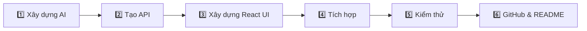

<div align="center">

# ✨ AI WEB APPS — NHÓM 6 ✨

### 🌸 Một website • Bốn chức năng AI • Một hệ thống thống nhất


<p>
  
  
  
  
</p>

<p>
  
  
  
  
</p>

**[🌟 Giới thiệu](#-giới-thiệu) · [🧠 Chức năng](#-4-chức-năng-ai) · [🖼️ Giao diện](#️-giao-diện-hệ-thống) · [🏗️ Kiến trúc](#️-kiến-trúc-hệ-thống) · [⚡ Cách chạy](#-cách-chạy) · [👥 Thành viên](#-phân-công-thành-viên)**

</div>

---

## 🌟 Giới thiệu

> [!NOTE]
> **AI Web Apps** là hệ thống web tích hợp **4 chức năng trí tuệ nhân tạo** trên cùng một nền tảng.  
> Frontend được xây dựng bằng **ReactJS**, backend sử dụng **FastAPI**, các module AI được tổ chức riêng để dễ phát triển, kiểm thử và tích hợp.

<div align="center">

| 🌻 Classification | 🎯 Object Detection | 🔎 Image Retrieval | 💬 RAG Chatbot |
|:---:|:---:|:---:|:---:|
| Phân loại hình ảnh | Nhận diện đối tượng | Tìm ảnh tương đồng | Hỏi đáp theo dữ liệu |
| `classifier.py` | `detector.py` | `retrieval.py` | `llm.py` |

</div>

---

# 🧠 4 CHỨC NĂNG AI

<table>
<tr>
<td width="50%" valign="top">

### 🌻 01 — Image Classification
**Phân loại hình ảnh**

- Nhận ảnh từ người dùng
- Tiền xử lý dữ liệu đầu vào
- Thực hiện dự đoán bằng model
- Trả nhãn và độ tin cậy
- Hiển thị kết quả trên ReactJS

`core/classifier.py`  
`web/src/features/Classify.jsx`  
`api/main.py → classify`

</td>
<td width="50%" valign="top">

### 🎯 02 — Object Detection
**Nhận diện đối tượng**

- Nhận diện nhiều đối tượng trong ảnh
- Xác định vị trí đối tượng
- Trả kết quả detection về API
- Hiển thị kết quả trực quan trên web

`core/detector.py`  
`web/src/features/Detect.jsx`  
`api/main.py → detect`

</td>
</tr>

<tr>
<td width="50%" valign="top">

### 🔎 03 — Image Retrieval
**Tìm kiếm ảnh tương đồng**

- Trích xuất đặc trưng ảnh
- So sánh mức độ tương đồng
- Tìm các ảnh gần nhất
- Hỗ trợ chọn ảnh từ giao diện

`core/retrieval.py`  
`web/src/features/Search.jsx`  
`web/src/components/ImagePicker.jsx`  
`api/main.py → search`

</td>
<td width="50%" valign="top">

### 💬 04 — RAG Chatbot
**Chatbot hỏi đáp theo Knowledge Base**

- Đọc dữ liệu Knowledge Base
- Truy xuất ngữ cảnh liên quan
- Kết hợp LLM để sinh câu trả lời
- Giao tiếp trực tiếp trên giao diện chat

`core/llm.py`  
`web/src/features/Chat.jsx`  
`data/kb/*`  
`api/main.py → chat`

</td>
</tr>
</table>

---

# 🖼️ GIAO DIỆN HỆ THỐNG

<div align="center">

### 🌸 Classification


<br/>

### 🎯 Object Detection


<br/>

### 🔎 Image Retrieval


<br/>

### 💬 RAG Chatbot


</div>

---

# 🏗️ KIẾN TRÚC HỆ THỐNG


### 🔄 Luồng xử lý

<div align="center">

**👤 Người dùng**　→　**⚛️ ReactJS**　→　**⚡ FastAPI**　→　**🧠 AI Modules**　→　**✨ Kết quả**

</div>

---

# 🛠️ TECH STACK

<div align="center">

| Layer | Công nghệ | Vai trò |
|:---:|---|---|
| 🎨 **Frontend** | ReactJS · JavaScript | Giao diện và tương tác người dùng |
| ⚡ **Backend** | FastAPI · Python | API và điều phối xử lý |
| 🧠 **AI Core** | PyTorch / AI Models | Classification · Detection · Retrieval |
| 💬 **RAG** | LLM · Knowledge Base | Truy xuất dữ liệu và sinh câu trả lời |
| 🗂️ **Version Control** | Git · GitHub | Quản lý mã nguồn và làm việc nhóm |

</div>

---

# 📁 CẤU TRÚC PROJECT

```text
Web_Nang-Cao_Nhom-6-/
│
├── 📂 api/
│   └── main.py
│
├── 📂 core/
│   ├── classifier.py
│   ├── detector.py
│   ├── retrieval.py
│   └── llm.py
│
├── 📂 data/
│   └── kb/
│
├── 📂 web/
│   └── src/
│       ├── features/
│       │   ├── Classify.jsx
│       │   ├── Detect.jsx
│       │   ├── Search.jsx
│       │   └── Chat.jsx
│       └── components/
│           └── ImagePicker.jsx
│
├── 📂 docs/
│   ├── classify.png
│   ├── detect.png
│   ├── search.png
│   └── chat.png
│
└── 📄 README.md
```

---

# ⚡ CÁCH CHẠY

### 1️⃣ Clone project

```bash
git clone https://github.com/ptthvy/Web_Nang-Cao_Nhom-6-.git
cd Web_Nang-Cao_Nhom-6-
```

### 2️⃣ Cài đặt Backend

```bash
pip install -r requirements.txt
```

### 3️⃣ Khởi chạy FastAPI

```bash
uvicorn api.main:app --reload
```

### 4️⃣ Khởi chạy Frontend

```bash
cd web
npm install
npm run dev
```

> [!TIP]
> Khởi chạy **Backend trước**, sau đó chạy **Frontend** để giao diện có thể gọi các API AI.

---

# 👥 PHÂN CÔNG THÀNH VIÊN

<div align="center">

| 👤 Thành viên | 🆔 MSSV | ⭐ Module chính | 🛠️ Phạm vi phụ trách |
|---|:---:|---|---|
| **Phạm Thảo Hiền Vy** | `24100439` | 🌻 **Image Classification** | `classifier.py` · `Classify.jsx` · classify API · **README & trình bày GitHub** |
| **Đào Bá Tuấn Ngọc** | `24100498` | 🎯 **Object Detection** | `detector.py` · `Detect.jsx` · detect API · kiểm thử detection |
| **Phạm Thế Duy** | `24100583` | 🔎 **Image Retrieval** | `retrieval.py` · `Search.jsx` · `ImagePicker.jsx` · search API |
| **Nguyễn Văn An** | `24100254` | 💬 **RAG Chatbot** | `llm.py` · `Chat.jsx` · `data/kb/*` · chat API · tích hợp hệ thống |

</div>  
# 🚀 QUY TRÌNH THỰC HIỆN



1. **Xây dựng AI Core** cho từng chức năng.
2. **Tạo FastAPI endpoint** kết nối frontend với module AI.
3. **Thiết kế giao diện ReactJS** cho từng chức năng.
4. **Tích hợp Frontend ↔ Backend ↔ AI**.
5. **Kiểm thử** và xử lý lỗi.
6. **Hoàn thiện GitHub, README và tài liệu trình bày**.

---

## ⚠️ Lưu ý

> [!IMPORTANT]
> Project được thực hiện phục vụ mục đích **học tập**. Kết quả của các mô hình AI phụ thuộc vào dữ liệu, model và thiết lập thử nghiệm được sử dụng trong bài.

---

<div align="center">

## 💙 THANK YOU FOR VISITING OUR PROJECT 💙

### ✨ AI Web Apps — Nhóm 6 ✨

**🌻 Classification　•　🎯 Detection　•　🔎 Retrieval　•　💬 RAG Chatbot**

<br/>


</div>
