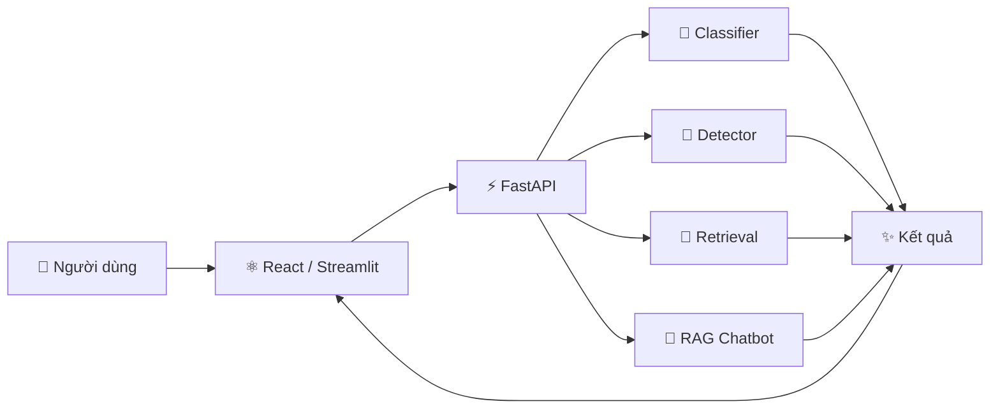

<div align="center">

# ✨ AI WEB APPS — NHÓM 6 ✨

### 🌸 Classification · 🎯 Object Detection · 🔎 Image Retrieval · 💬 RAG Chatbot

**Đồ án môn Lập trình Web nâng cao — Phenikaa University**


> 🚀 **Một website — Bốn chức năng AI — Một backend FastAPI thống nhất**

[📸 Giao diện](#-giao-diện-hệ-thống) • [🧠 Chức năng](#-4-chức-năng-ai) • [🏗️ Kiến trúc](#️-kiến-trúc-hệ-thống) • [⚡ Cách chạy](#-cách-chạy) • [👥 Thành viên](#-thành-viên)

</div>

---

## 🌟 Giới thiệu

**AI Web Apps** là bài tập nhóm xây dựng một hệ thống web tích hợp **4 chức năng trí tuệ nhân tạo** trên cùng một nền tảng. Hệ thống sử dụng **ReactJS** cho giao diện, **FastAPI** cho backend và các mô hình AI cho từng tác vụ.

> 📚 Mã nguồn được phát triển dựa trên notebook `AI_Web_Apps_Streamlit_React.ipynb` do giảng viên cung cấp. Nhóm thực hiện chạy notebook, huấn luyện/nạp mô hình, kiểm thử từng chức năng và đóng gói thành project hoàn chỉnh.

<table>
<tr>
<td width="25%" align="center"><b>🌻 Classification</b><br/>Phân loại 5 loài hoa</td>
<td width="25%" align="center"><b>🎯 Detection</b><br/>Nhận diện đối tượng</td>
<td width="25%" align="center"><b>🔍 Retrieval</b><br/>Tìm ảnh tương đồng</td>
<td width="25%" align="center"><b>🤖 RAG Chatbot</b><br/>Hỏi đáp theo tài liệu</td>
</tr>
</table>

---

## 📸 Giao diện hệ thống

<table>
<tr>
<td width="50%" align="center">
<h3>🌻 Image Classification</h3>

<br/><sub>ResNet-18 phân loại ảnh hoa và hiển thị độ tin cậy.</sub>
</td>
<td width="50%" align="center">
<h3>🎯 Object Detection</h3>

<br/><sub>YOLO11n phát hiện, đóng khung và gắn nhãn đối tượng.</sub>
</td>
</tr>
<tr>
<td width="50%" align="center">
<h3>🔎 Image Retrieval</h3>

<br/><sub>CLIP + FAISS tìm ảnh tương đồng theo truy vấn.</sub>
</td>
<td width="50%" align="center">
<h3>💬 RAG Chatbot</h3>

<br/><sub>Chatbot ShopLite trả lời dựa trên kho tài liệu nội bộ.</sub>
</td>
</tr>
</table>

---

## 🧠 4 chức năng AI

| | Chức năng | Công nghệ | Mô tả |
|:--:|---|---|---|
| 🌸 | **Phân loại hoa** | ResNet-18 | Nhận ảnh đầu vào và dự đoán 1 trong 5 loài hoa |
| 🎯 | **Phát hiện đối tượng** | YOLO11n | Xác định vị trí, nhãn và độ tin cậy của đối tượng |
| 🔎 | **Tìm kiếm ảnh** | CLIP + FAISS | Tìm ảnh tương đồng bằng ảnh hoặc mô tả tiếng Anh |
| 💬 | **Chatbot RAG** | MiniLM + FAISS + Qwen | Truy xuất tài liệu liên quan rồi sinh câu trả lời |

---

## 🏗️ Kiến trúc hệ thống

<div align="center">



**Người dùng → Giao diện → FastAPI → AI Modules → Kết quả**

</div>

### 📂 Cấu trúc chính

```text
Web_Nang-Cao_Nhom-6-
│
├── 🧠 core/               # 4 module AI / inference
├── ⚡ api/                # FastAPI backend
├── ⚛️ web/                # React + Vite frontend
├── 💬 data/kb/            # Knowledge Base cho RAG
├── 📊 artifacts/          # Model + metrics
├── 🖼️ docs/               # Ảnh giao diện / tài liệu
├── 🎛️ config.py           # Cấu hình hệ thống
└── 🚀 streamlit_app.py    # Giao diện Streamlit
```

- **`core/`** — xử lý suy luận của mô hình, độc lập với giao diện web.
- **`api/`** — cung cấp API HTTP bằng FastAPI và phục vụ bản build React.
- **`web/`** — giao diện React + Vite.
- **`streamlit_app.py`** — giao diện Streamlit sử dụng chung API.
- **`config.py`** — cấu hình mô hình bằng biến môi trường.
- **`artifacts/`** — lưu mô hình và các file đánh giá.

---

## 📊 Mô hình & kết quả

| 🎯 Chức năng | 🧠 Mô hình | 📦 Dữ liệu | 📈 Kết quả |
|---|---|---|---|
| 🌻 Phân loại hoa | **ResNet-18** | TF Flowers — 3.670 ảnh / 5 lớp | **Accuracy 95,1% · F1 95,1%** |
| 🎯 Phát hiện đối tượng | **YOLO11n** | COCO128 | **mAP50 0,67 · mAP50-95 0,50** |
| 🔎 Tìm kiếm ảnh | **CLIP ViT-B/32 + FAISS** | COCO128 + ảnh hoa — 628 ảnh | **Precision@5 = 0,88** |
| 💬 Chatbot RAG | **MiniLM + FAISS + Qwen2.5** | 6 tài liệu ShopLite | **Hit@1 = Hit@3 = 1,0*** |

<sub>*Các số đo được lấy từ `artifacts/*/metrics.json` và `artifacts/rag_metrics.json`. Xem mục Hạn chế để hiểu phạm vi đánh giá.</sub>

---

## ⚡ Cách chạy

### ☁️ Cách 1 — Google Colab

> ⭐ **Khuyến nghị:** mở notebook trên Google Colab → bật **GPU T4** → chọn **Run all**. Ở cuối notebook sẽ xuất hiện link giao diện React và Streamlit.

### 💻 Cách 2 — Chạy trên máy

**Yêu cầu:** `Python 3.11` · `Node.js 22`

```bash
# 1. Clone project
git clone https://github.com/ptthvy/Web_Nang-Cao_Nhom-6-.git
cd Web_Nang-Cao_Nhom-6-

# 2. Cài thư viện Python
pip install -r requirements.txt

# 3. Chạy Backend + React build
uvicorn api.main:app --port 8000
```

Sau đó mở: `http://localhost:8000`

**Chạy Streamlit:**

```bash
pip install -r requirements-streamlit.txt
API_URL=http://localhost:8000 streamlit run streamlit_app.py
```

**Chạy React ở development mode:**

```bash
cd web
npm install
npm run dev
```

---

## ⚙️ Biến môi trường

| Biến | Mặc định | Ý nghĩa |
|---|---|---|
| `ENABLED_MODELS` | `classifier,detector,retrieval,llm` | Các mô hình được nạp |
| `LLM_MODEL` | Qwen2.5 Instruct | Mô hình sinh câu trả lời |
| `EMBED_MODEL` | MiniLM L12 v2 | Embedding cho RAG |
| `CLIP_MODEL` | CLIP ViT-B/32 | Mô hình tìm kiếm ảnh |
| `CORS_ORIGINS` | localhost | Các địa chỉ được phép gọi API |

---

## 👥 Thành viên

<div align="center">

| 👤 Thành viên | 🆔 MSSV | 💻 Phụ trách |
|---|:---:|---|
| **Phạm Thảo Hiền Vy** | `24100439` | Chatbot RAG · Kiểm thử · Giao diện chatbot |
| **Đào Bá Tuấn Ngọc** | `24100498` | Slide trình bày · Tài liệu `docs/` |
| **Phạm Thế Duy** | `24100583` | README · Rà soát tài liệu · Khai báo AI |
| **Nguyễn Văn An** | `24100254` | Colab · GitHub · Kiểm thử · Tích hợp & nộp bài |

</div>

---

## ⚠️ Hạn chế

> [!IMPORTANT]
> Đây là project phục vụ mục đích học tập. Các chỉ số đánh giá cần được hiểu trong phạm vi bộ dữ liệu và thiết lập thử nghiệm của bài.

- 🌸 **Classification:** chỉ nhận biết 5 loài hoa; ảnh ngoài 5 lớp vẫn bị gán vào một lớp gần nhất.
- 🎯 **Detection:** đánh giá trên COCO128 nên chưa phản ánh đầy đủ chất lượng trên dữ liệu hoàn toàn mới.
- 🔎 **Retrieval:** CLIP gốc hoạt động tốt nhất với truy vấn tiếng Anh; kho ảnh hiện có 628 ảnh.
- 💬 **RAG:** mô hình ngôn ngữ nhỏ vẫn có khả năng trả lời chưa chính xác; tập đánh giá chatbot còn nhỏ.
- ☁️ **Deployment:** link demo phụ thuộc vào phiên Google Colab và chưa được triển khai trên server cố định.

---

## 🤖 Khai báo sử dụng AI

| Công cụ | Phiên bản | Mục đích |
|---|---|---|
| **Codex — OpenAI** | GPT-5.6 Terra | Hỗ trợ chạy notebook, hoàn thiện web, GitHub, README và slide |

**Các mô hình AI trong sản phẩm:** `ResNet-18` · `YOLO11n` · `CLIP ViT-B/32` · `MiniLM-L12-v2` · `Qwen2.5-Instruct`

---

<div align="center">

### 💙 AI WEB APPS · NHÓM 6

**Lập trình Web nâng cao · Phenikaa University**

Made with ☕ + 💻 + 🤖

⭐ **Nếu project hữu ích, hãy để lại một Star!** ⭐

</div>
