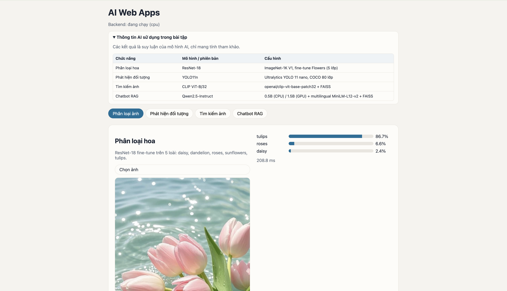
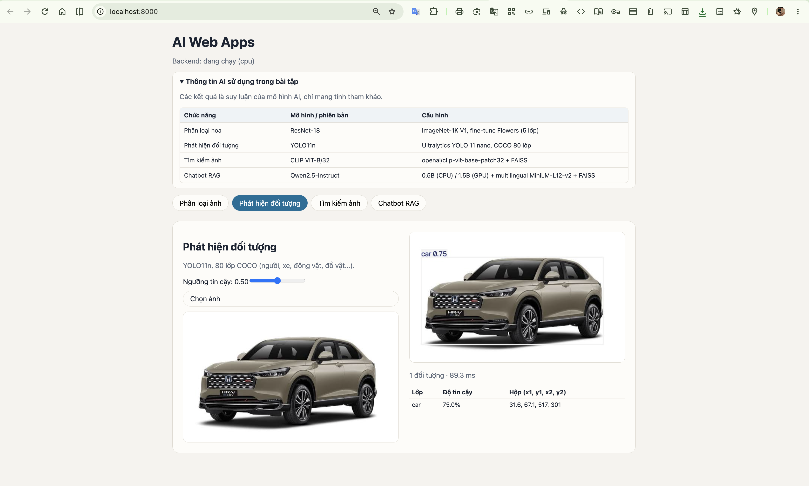
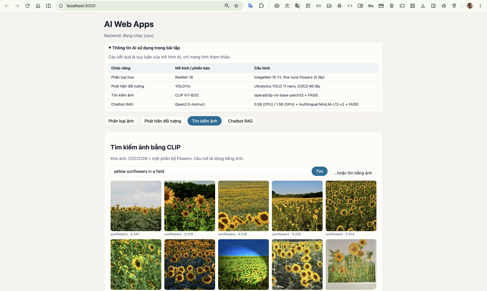
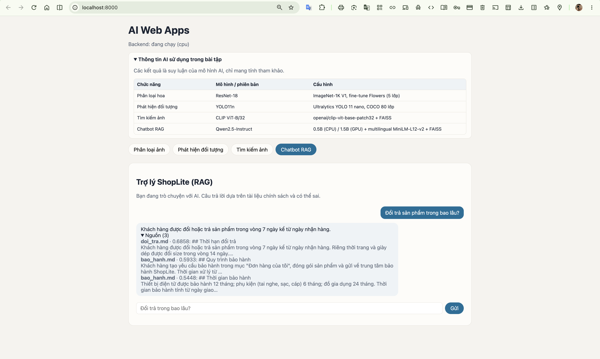
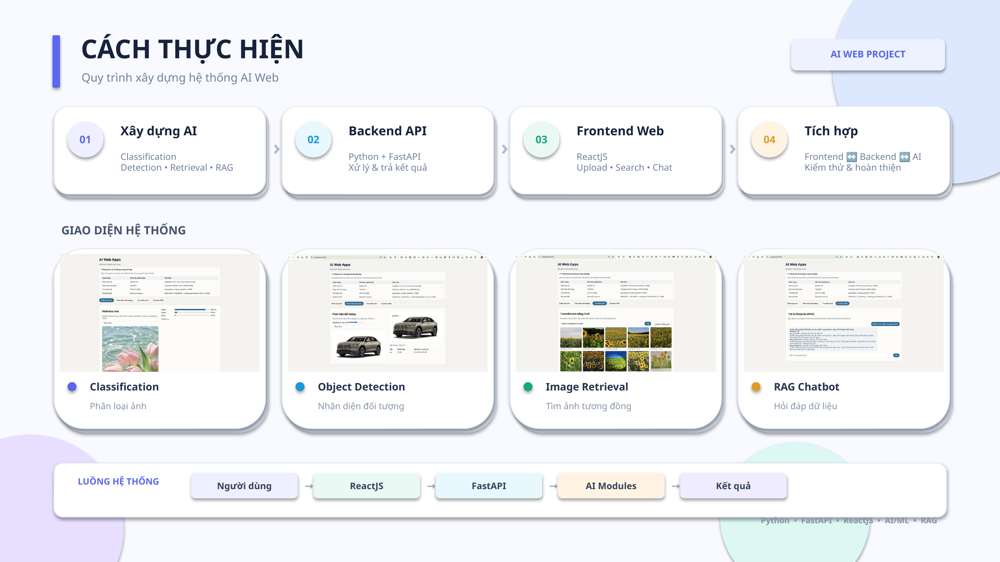
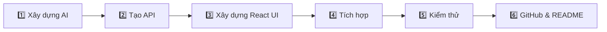

<div align="center">

# ✨ AI WEB APPS — NHÓM 6 ✨

### 🌸 Một website • Bốn chức năng AI • Một hệ thống thống nhất


<p>
  
  
  
  
</p>

<p>
  
  
  
  
</p>

**[🌟 Giới thiệu](#-giới-thiệu) · [🧠 Chức năng](#-4-chức-năng-ai) · [🖼️ Giao diện](#️-giao-diện-hệ-thống) · [🎤 Slide](#-slide-thuyết-trình) · [🏗️ Kiến trúc](#️-kiến-trúc-hệ-thống) · [⚡ 2 cách sử dụng](#-2-cách-sử-dụng-hệ-thống) · [👥 Thành viên](#-phân-công-thành-viên)**

</div>

---

## 🌟 Giới thiệu

> [!NOTE]
> **AI Web Apps** là hệ thống web tích hợp **4 chức năng trí tuệ nhân tạo** trên cùng một nền tảng.  
> Frontend được xây dựng bằng **ReactJS**, backend sử dụng **FastAPI**, các module AI được tổ chức riêng để dễ phát triển, kiểm thử và tích hợp.

<div align="center">

| 🌻 Classification | 🎯 Object Detection | 🔎 Image Retrieval | 💬 RAG Chatbot |
|:---:|:---:|:---:|:---:|
| Phân loại hình ảnh | Nhận diện đối tượng | Tìm ảnh tương đồng | Hỏi đáp theo dữ liệu |
| `classifier.py` | `detector.py` | `retrieval.py` | `llm.py` |

</div>

---

# 🧠 4 CHỨC NĂNG AI

<table>
<tr>
<td width="50%" valign="top">

### 🌻 01 — Image Classification
**Phân loại hình ảnh**

- Nhận ảnh từ người dùng
- Tiền xử lý dữ liệu đầu vào
- Thực hiện dự đoán bằng model
- Trả nhãn và độ tin cậy
- Hiển thị kết quả trên ReactJS

`core/classifier.py`  
`web/src/features/Classify.jsx`  
`api/main.py → classify`

</td>
<td width="50%" valign="top">

### 🎯 02 — Object Detection
**Nhận diện đối tượng**

- Nhận diện nhiều đối tượng trong ảnh
- Xác định vị trí đối tượng
- Trả kết quả detection về API
- Hiển thị kết quả trực quan trên web

`core/detector.py`  
`web/src/features/Detect.jsx`  
`api/main.py → detect`

</td>
</tr>

<tr>
<td width="50%" valign="top">

### 🔎 03 — Image Retrieval
**Tìm kiếm ảnh tương đồng**

- Trích xuất đặc trưng ảnh
- So sánh mức độ tương đồng
- Tìm các ảnh gần nhất
- Hỗ trợ chọn ảnh từ giao diện

`core/retrieval.py`  
`web/src/features/Search.jsx`  
`web/src/components/ImagePicker.jsx`  
`api/main.py → search`

</td>
<td width="50%" valign="top">

### 💬 04 — RAG Chatbot
**Chatbot hỏi đáp theo Knowledge Base**

- Đọc dữ liệu Knowledge Base
- Truy xuất ngữ cảnh liên quan
- Kết hợp LLM để sinh câu trả lời
- Giao tiếp trực tiếp trên giao diện chat

`core/llm.py`  
`web/src/features/Chat.jsx`  
`data/kb/*`  
`api/main.py → chat`

</td>
</tr>
</table>

---

# 🖼️ GIAO DIỆN HỆ THỐNG

<div align="center">

### 🌸 Classification


<br/>

### 🎯 Object Detection


<br/>

### 🔎 Image Retrieval


<br/>

### 💬 RAG Chatbot


</div>

---

<<div align="center">
# 🎤 SLIDE QUY TRÌNH 
<a href="docs/Web_Apps_Nhom6.pptx">
  
</a>

<br/><br/>

<a href="docs/Web_Apps_Nhom6.pptx">
  
</a>

<p><b>👆 Nhấn vào hình hoặc nút phía trên để xem PowerPoint</b></p>

</div>

**🧠 AI Modules　→　⚡ FastAPI　→　⚛️ ReactJS　→　🔗 Tích hợp & Kiểm thử**

</div>

### 📌 Nội dung trình bày

| Phần | Nội dung |
|---|---|
| 🎯 **Mục tiêu** | Xây dựng website tích hợp 4 chức năng AI |
| 🧠 **AI Core** | Classification · Detection · Retrieval · RAG Chatbot |
| ⚡ **Backend** | FastAPI kết nối giao diện với các module AI |
| ⚛️ **Frontend** | ReactJS xây dựng giao diện tương tác |
| 🔄 **Cách làm** | AI Core → API → Frontend → Tích hợp → Kiểm thử |
| 🖼️ **Demo** | Giao diện thực tế của 4 chức năng |

> [!IMPORTANT]
> Đặt file PowerPoint của nhóm tại **`docs/AI_Web_Apps_Nhom6.pptx`** để nút **Xem slide thuyết trình** phía trên hoạt động trực tiếp trên GitHub.

---

# 🏗️ KIẾN TRÚC HỆ THỐNG


### 🔄 Luồng xử lý

<div align="center">

**👤 Người dùng**　→　**⚛️ ReactJS**　→　**⚡ FastAPI**　→　**🧠 AI Modules**　→　**✨ Kết quả**

</div>

---

# 🛠️ TECH STACK

<div align="center">

| Layer | Công nghệ | Vai trò |
|:---:|---|---|
| 🎨 **Frontend** | ReactJS · JavaScript | Giao diện và tương tác người dùng |
| ⚡ **Backend** | FastAPI · Python | API và điều phối xử lý |
| 🧠 **AI Core** | PyTorch / AI Models | Classification · Detection · Retrieval |
| 💬 **RAG** | LLM · Knowledge Base | Truy xuất dữ liệu và sinh câu trả lời |
| 🗂️ **Version Control** | Git · GitHub | Quản lý mã nguồn và làm việc nhóm |

</div>

---

# 📁 CẤU TRÚC PROJECT

```text
Web_Nang-Cao_Nhom-6-/
│
├── 📂 api/
│   └── main.py
│
├── 📂 core/
│   ├── classifier.py
│   ├── detector.py
│   ├── retrieval.py
│   └── llm.py
│
├── 📂 data/
│   └── kb/
│
├── 📂 web/
│   └── src/
│       ├── features/
│       │   ├── Classify.jsx
│       │   ├── Detect.jsx
│       │   ├── Search.jsx
│       │   └── Chat.jsx
│       └── components/
│           └── ImagePicker.jsx
│
├── 📂 docs/
│   ├── classify.png
│   ├── detect.png
│   ├── search.png
│   └── chat.png
│
└── 📄 README.md
```

---

# ⚡ 2 CÁCH SỬ DỤNG HỆ THỐNG

<div align="center">

| ☁️ **CÁCH 1 — GOOGLE COLAB** | 💻 **CÁCH 2 — CHẠY LOCAL** |
|:---:|:---:|
| Nhanh, thuận tiện, không cần cấu hình nhiều trên máy | Chạy đầy đủ Frontend + Backend + AI Core |
| **Notebook → Models → App → Demo** | **ReactJS → FastAPI → AI Modules** |

</div>

---

## ☁️ Cách 1 — Sử dụng Google Colab

> [!TIP]
> Phù hợp khi cần **chạy thử nhanh hoặc demo project** mà không muốn cài đặt toàn bộ môi trường AI trên máy cá nhân.

### 1️⃣ Mở Notebook trên Google Colab

Mở file notebook của project:

```text
AI_Web_Apps_Streamlit_React.ipynb
```

### 2️⃣ Thiết lập Runtime

Trong Google Colab, chọn:

```text
Runtime → Change runtime type → GPU
```

nếu notebook/model cần tăng tốc bằng GPU.

### 3️⃣ Chạy lần lượt các cell

```text
Cài thư viện
      ↓
Nạp / khởi tạo model
      ↓
Chuẩn bị dữ liệu
      ↓
Khởi chạy ứng dụng
      ↓
Mở đường dẫn giao diện
```

### 4️⃣ Sử dụng các chức năng AI

Sau khi hệ thống khởi chạy, có thể kiểm thử:

- 🌻 **Image Classification** — phân loại ảnh.
- 🎯 **Object Detection** — nhận diện đối tượng.
- 🔎 **Image Retrieval** — tìm kiếm ảnh tương đồng.
- 💬 **RAG Chatbot** — hỏi đáp theo Knowledge Base.

> [!NOTE]
> Khi chạy bằng Colab, cần giữ phiên Colab hoạt động trong quá trình sử dụng ứng dụng.

---

## 💻 Cách 2 — Chạy Local với ReactJS + FastAPI

> [!TIP]
> Phù hợp để **phát triển, kiểm thử và chỉnh sửa source code** trực tiếp trên máy.

### 1️⃣ Clone repository

```bash
git clone https://github.com/ptthvy/Web_Nang-Cao_Nhom-6-.git
cd Web_Nang-Cao_Nhom-6-
```

### 2️⃣ Cài đặt thư viện Backend

```bash
pip install -r requirements.txt
```

### 3️⃣ Khởi chạy FastAPI Backend

```bash
uvicorn api.main:app --reload
```

Backend chịu trách nhiệm nhận request từ giao diện và chuyển dữ liệu đến các module AI:

```text
api/main.py
     │
     ├── classify → core/classifier.py
     ├── detect   → core/detector.py
     ├── search   → core/retrieval.py
     └── chat     → core/llm.py
```

### 4️⃣ Cài đặt và chạy ReactJS Frontend

Mở terminal mới:

```bash
cd web
npm install
npm run dev
```

### 5️⃣ Truy cập giao diện

Mở địa chỉ mà terminal React/Vite hiển thị và sử dụng các chức năng của hệ thống.

<div align="center">

### 🔄 Luồng chạy Local

**👤 User** → **⚛️ ReactJS** → **⚡ FastAPI** → **🧠 AI Core** → **✨ Result**

</div>

> [!IMPORTANT]
> Khi chạy Local, hãy đảm bảo **Backend FastAPI đang hoạt động trước hoặc đồng thời với Frontend** để các chức năng có thể gọi API thành công.

---

### 🎯 Nên dùng cách nào?

<div align="center">

| Nhu cầu | Cách phù hợp |
|---|:---:|
| 🚀 Demo nhanh | ☁️ **Google Colab** |
| 🧪 Chạy thử model | ☁️ **Google Colab** |
| 💻 Phát triển source code | 💻 **Local** |
| 🎨 Chỉnh sửa ReactJS | 💻 **Local** |
| ⚡ Kiểm thử API FastAPI | 💻 **Local** |
| 🔗 Kiểm thử toàn bộ Frontend ↔ Backend ↔ AI | 💻 **Local** |

</div>

---

# 👥 PHÂN CÔNG THÀNH VIÊN

<div align="center">

| 👤 Thành viên | 🆔 MSSV | ⭐ Module chính | 🛠️ Phạm vi phụ trách |
|---|:---:|---|---|
| **Nguyễn Văn An** | `24100254` | 🌻 **Image Classification** | `core/classifier.py` · `Classify.jsx` · phần classify trong `api/main.py` |
| **Đào Bá Tuấn Ngọc** | `24100498` | 🎯 **Object Detection** | `core/detector.py` · `Detect.jsx` · phần detect trong `api/main.py` |
| **Phạm Thế Duy** | `24100583` | 🔎 **Image Retrieval** | `core/retrieval.py` · `Search.jsx` · `ImagePicker.jsx` · phần search trong `api/main.py` |
| **Phạm Thảo Hiền Vy** | `24100439` | 💬 **Chatbot / RAG** | `core/llm.py` · `Chat.jsx` · `data/kb/*` · phần chat trong `api/main.py`  |

</div>
# 🚀 QUY TRÌNH THỰC HIỆN



1. **Xây dựng AI Core** cho từng chức năng.
2. **Tạo FastAPI endpoint** kết nối frontend với module AI.
3. **Thiết kế giao diện ReactJS** cho từng chức năng.
4. **Tích hợp Frontend ↔ Backend ↔ AI**.
5. **Kiểm thử** và xử lý lỗi.
6. **Hoàn thiện GitHub, README và tài liệu trình bày**.

---

## ⚠️ Lưu ý

> [!IMPORTANT]
> Project được thực hiện phục vụ mục đích **học tập**. Kết quả của các mô hình AI phụ thuộc vào dữ liệu, model và thiết lập thử nghiệm được sử dụng trong bài.

---

<div align="center">

## 💙 THANK YOU FOR VISITING OUR PROJECT 💙

### ✨ AI Web Apps — Nhóm 6 ✨

**🌻 Classification　•　🎯 Detection　•　🔎 Retrieval　•　💬 RAG Chatbot**

<br/>


</div>
